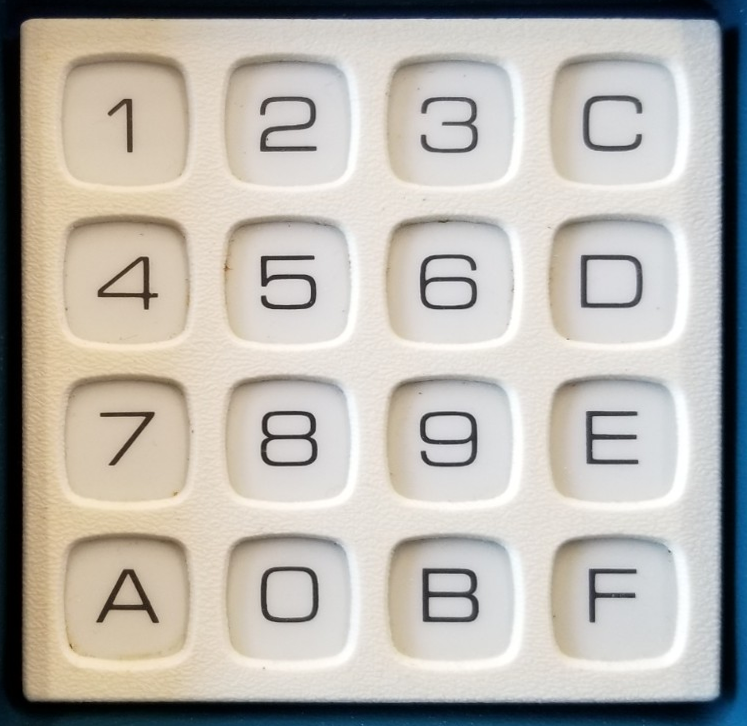

# [2024-12-13-1] Devlog: CHIP-8

# Introduction

Starting this devlog to get into the habit of documenting the development
process for my projects. In a way this also holds me accountable to finish
the project, since there is the possibility of people finidng this repo and
looking at the way I structure a (rather small) coding project.

In this session, my objectives are:
- To find out more about the CHIP-8 architecture
- Define the scope of the project

# About CHIP-8

CHIP-8 isn't actually tied to any hardware. It is an interpreted language that
was simple enough so that interpreters can be written for virtually any hardware.

CHIP-8 defines a virtual machine that will be used when executing instructions.
This machine consists of the following:

## Registers

As with all processors, the CHIP-8 machine contains registers.

The machine has 16 data registers, V0 to VF. Each register is 8 bits wide.

The VF register is special, and is often avoided.

The machine also has an address register, I, and a program counter, PC, that are
12 bits wide.

## Memory

The machine has 4096 bytes of addressable memory. 

The reason for the 12 bit I and PC registers is due to the limited amount of
memory that machines had when CHIP-8 was invented. Most machines only had 4096 
bytes of RAM, which can be fully addressed using only 12 bits.
- Therefore, in reality, the I and PC register are 16 bits wide but only 12 bits
are used.

### Memory Layout

The first 512 bytes (0x0000 to 0x01FF) are reserved. This used to be the location
of the actual CHIP-8 interpreter in RAM. When emulating, we do not have to put
our interpreter in this region anymore.

In this region, the sprite data for the CHIP-8's built-in font is stored. There
is an instruction allows a program to point to a particular sprite in this
region, so this sprite data still needs to be emulated. The data can be found
online, and hard-coded starting at address 0x0050 (although you could really
place the data anywhere in the first 512 bytes, but 0x50 is a popular choice).

The entire rest of the memory space, starting from 0x0200, is where the CHIP-8 
program starts. All execution must start at this address, and so the first 
instruction also lives at 0x200.
- Every instruction is represented as a 2-byte opcode, always.
- Therefore, reading instructions from the program memory becomes very easy.

## Stack

The stack is only used for storing addresses, when calling and returning from
subroutines - nothing else.

There is no specification on the size of the stack, but it should hold at least
two addresses. (The RCA 1802 implementation allocated 48 bytes).

## Delay and Sound Timers

Timers are 8-bit registers that store a number. This number, once set to a
nonzero value, is automatically decremented 60 times per second.
- For example, if the program sets a timer to 120, then in two seconds, the value
would have decremented to 0.

There are two timers, a "delay timer" and a "sound timer".

The program can read and write to the delay timer for any general purpose.

The sound timer can only be set, but while its value is nonzero, it triggers a 
beeping sound. The tone of the sound is fixed.

## Framebuffer

In terms of displaying content, the machine has a separate piece of memory called
the framebuffer. This region is write-only to the program, and contains the pixel
values of the display. 

A separate display device will take this framebuffer, and decode it into their
respective outputs.

The framebuffer represents a display size of 64 by 32 monochrome pixels. In 
memory, each pixel is either 0 for "off" and 1 for "on".
- Therefore, a byte actually represents 8 pixels.
- 16 bytes represents a row (64 pixels).
- 32 of those rows represents the entire display.

## Keypad

Other than outputs, the machine takes in inputs in the form of a keypad.

There are instructions that checks the value of the key being pressed, and
a single instruction that blocks execution until a keypress occurs.

## The CHIP-8 Machine Is Simple
Those are all the components of the CHIP-8 machine! From this description,
there are very direct mappings of the components into C, such as registers.

# About CHIP-8.C

This is where I define that the project is, and some objectives to hit.

Firstly, the main objective of this project is to learn about emulation.
Although CHIP-8 is technically an interpreted language, the interpreter itself
needs to emulate all the components of the virtual machine in order to execute
instructions. Therefore, it is the best way to learn about emulation from someone
who has only finished one-quarter of a 6502 emulator in the past.

Secondly, a target that I want to hit is to run games on this emulator. Building
a CHIP-8 emulator is fun, but getting to play games on it makes it even funner.

Lastly, I want to use this project to improve my development skills. I want to
have a finished side-project. While doing all this devlog and documentation
takes away coding time, it also holds me accountable for all the design decisions
that I make during this project.

In the next session, I will
- Talk about handling instructions.
- Lay out the initial architecture of the project.
- Start working on foundational code/code structure.