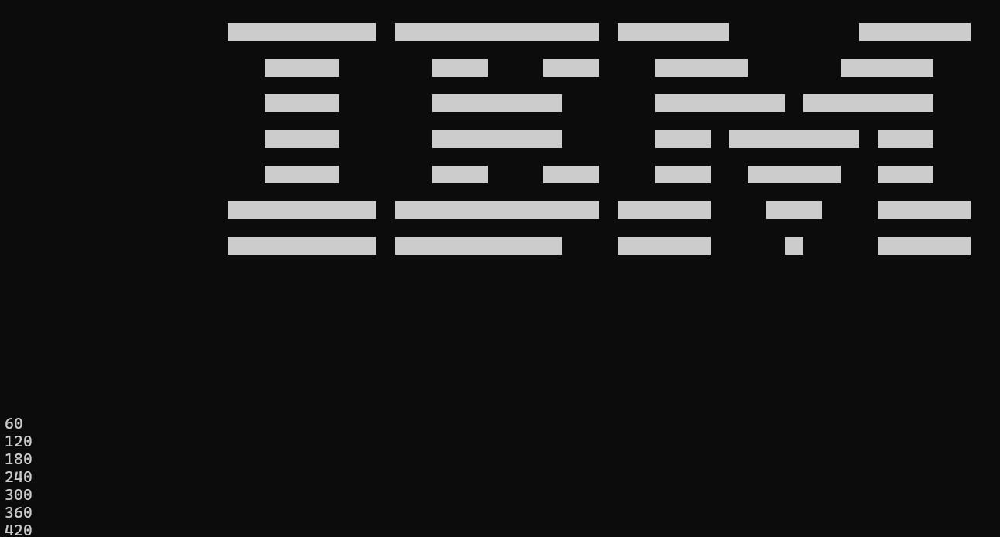

# [2024-12-14-2] Devlog: CHIP-8

# Introduction

In this session, my objectives are:
- Implement as many CHIP-8 instructions as I can

There are only 35 of them - this shouldn't take too long.

# Instruction: `00EE`

This instruction pops an address from the stack, and sets the PC register to it.

It is much like a return opcode. Its counterpart is `2NNN`, which will be
implemented later.

In order to implement this, we need to take note of where the top of the stack
is, which will be an additional state in the CHIP-8 machine:

```c
struct c8_machine {
    // ...

    uint16_t stack[C8_STACK_LEN];
    int stack_top;

    // ...
};

void c8_init(c8_machine_t machine) {
    // ...

    machine->stack_top = -1;
}
```

Then the final instruction will look like this:

```c
case 0x0:
    // ...

    if (instruction == 0x00EE) {
        machine->registers.PC = machine->stack[machine->stack_top--];
    }
```

# Instruction: `2NNN`

This instruction pushes the current PC register address to the stack, then sets
the PC register to `NNN`.

This is similar the a call opcode. The value that is pushed to the stack will be
the address of the next instruction, since the PC register is incremented during
the fetch phase.

# Instruction `3XNN`, `4XNN`, `5XY0`, `9XY0`

These are conditional skip instructions.

These will "skip" instructions (by incrementing the PC register by 2) based on 
certain conditions defined by the instruction.

The instruction `3XNN` skips when `V[X]` is equal to `NN`.

The instruction `4XNN` skips when `V[X]` is NOT equal to `NN`.

```c
case 0x3:
    if (machine->registers.V[X] == NN) {
        machine->registers.PC += 2;
    }

    break;
case 0x4:
    if (machine->registers.V[X] != NN) {
        machine->registers.PC += 2;
    }

    break;
```

The instruction `5XY0` skips when `V[X]` is equal to `V[Y]`.

The instruction `9XY0` skips when `V[X]` is NOT equal to `V[Y]`.

```c
case 0x5:
    if (machine->registers.V[X] == machine->registers.V[Y]) {
        machine->registers.PC += 2;
    }

    break;
case 0x9:
    if (machine->registers.V[X] != machine->registers.V[Y]) {
        machine->registers.PC += 2;
    }

    break;
```

# Instructions `8XY?`

These instructions are the arithmetic and logic operations.

All operations store their result in `V[X]`.

The last nibble is used to determine what operation it is. Some instructions 
might not use `V[Y]`.

Because of this, another switch statement on the last nibble (named as `N`) must
be used:

```c
case 0x8:
    switch (N) {
        case 0x0:
        case 0x1:
        case 0x2:
        case 0x3:
        case 0x4:
        case 0x5:
        case 0x6:
        case 0x7:
        case 0xE:

        default:
            break;
    }

    break;
```

Here is a table with all the instructions and their meaning:

| Instruction | Description                                                                 |
|-------------|-----------------------------------------------------------------------------|
| `8XY0`      | Set `V[X] = V[Y]`.                                                         |
| `8XY1`      | Set `V[X] = V[X] \| V[Y]`. Perform bitwise OR between `V[X]` and `V[Y]`.    |
| `8XY2`      | Set `V[X] = V[X] & V[Y]`. Perform bitwise AND between `V[X]` and `V[Y]`.   |
| `8XY3`      | Set `V[X] = V[X] ^ V[Y]`. Perform bitwise XOR between `V[X]` and `V[Y]`.   |
| `8XY4`      | Set `V[X] = V[X] + V[Y]`. Set `V[F] = 1` if there is a carry, else `V[F] = 0`. |
| `8XY5`      | Set `V[X] = V[X] - V[Y]`. Set `V[F] = 0` if there is a borrow, else `V[F] = 1`.|
| `8XY6`      | Set `V[X] = V[X] >> 1`. Store the least significant bit of `V[X]` in `V[F]`. |
| `8XY7`      | Set `V[X] = V[Y] - V[X]`. Set `V[F] = 0` if there is a borrow, else `V[F] = 1`.|
| `8XYE`      | Set `V[X] = V[X] << 1`. Store the most significant bit of `V[X]` in `V[F]`.  |

The final implementation looks like this:

```c
case 0x8:
    switch (N) {
        case 0x0:
            machine->registers.V[X] = machine->registers.V[Y];

            break;
        case 0x1:
            machine->registers.V[X] |= machine->registers.V[Y];

            break;
        case 0x2:
            machine->registers.V[X] &= machine->registers.V[Y];

            break;
        case 0x3:
            machine->registers.V[X] ^= machine->registers.V[Y];

            break;
        case 0x4: {
            uint8_t VX = machine->registers.V[X];
            machine->registers.V[X] += machine->registers.V[Y];

            machine->registers.V[0xF] = machine->registers.V[X] <= VX;
        } break;
        case 0x5: {
            uint8_t VX = machine->registers.V[X];
            machine->registers.V[X] -= machine->registers.V[Y];

            machine->registers.V[0xF] = machine->registers.V[X] <= VX;
        } break;
        case 0x6:
            machine->registers.V[0xF] = machine->registers.V[X] & 0x1;
            machine->registers.V[X]   = machine->registers.V[X] >> 1;

            break;
        case 0x7: {
            uint8_t VX = machine->registers.V[X];
            uint8_t VY = machine->registers.V[Y];

            machine->registers.V[X] = VY - VX;

            machine->registers.V[0xF] = VX <= VY;

        } break;
        case 0xE:
            machine->registers.V[0xF] = (machine->registers.V[X] >> 7) & 0x1;
            machine->registers.V[X]   = machine->registers.V[X] << 1;

            break;
        default:
            break;
    }

    break;
```

# Instruction `BNNN`

This instruction sets the PC register to `NNN + V[0]`.

There is a variation, `BXNN`, that instead jumps to `XNN + V[X]`.

The original implementation will be used.

```c
case 0xB:
    machine->registers.PC = NNN + machine->registers.V[0];

    break;
```

# Instruction: `CXNN`

This instruction generates a random byte (between 0x00 and 0xFF inclusive),
and does a bitwise AND with `NN`.

The result is stored in `V[X]`.

```c
case 0xC:
    machine->registers.V[X] = rand() & NN;

    break;
```

In this implementation, rand() produces an `int`. This does not matter as
ANDing with `NN` will always yield a value from 0 to 255.

# Instructions: `EX9E` and `EXA1`

These are skip instructions that depend on the keypad input.

During execution, the machine will poll the keypad if there are any keys being
pressed down.

The instruction `EX9E` skips if the key being pressed is equal to `V[X]`.

The instruction `EXA1` does the opposite.

```c
case 0xE:
    if (NN == 0x9E) {
        if (machine->keypad == machine->registers.V[X]) {
            machine->registers.PC += 2;
        }
    }

    if (NN == 0xA1) {
        if (machine->keypad != machine->registers.V[X]) {
            machine->registers.PC += 2;
        }
    }

    break;
```

In order for this to work, `machine->keypad` needs to be updated every frame.

This can be done in the main loop of the emulator (sorry linux users):

```c
void c8_handle_input(c8_machine_t machine) {
    if (!_kbhit()) {
        machine->keypad = 0x69;
        return;
    }

    char c = _getch();

    switch (c) {
        case '1': machine->keypad = 0x1; break;
        case '2': machine->keypad = 0x2; break;
        case '3': machine->keypad = 0x3; break;
        case '4': machine->keypad = 0xC; break;
        case 'Q': case 'q': machine->keypad = 0x4; break;
        case 'W': case 'w': machine->keypad = 0x5; break;
        case 'E': case 'e': machine->keypad = 0x6; break;
        case 'R': case 'r': machine->keypad = 0xD; break;
        case 'A': case 'a': machine->keypad = 0x7; break;
        case 'S': case 's': machine->keypad = 0x8; break;
        case 'D': case 'd': machine->keypad = 0x9; break;
        case 'F': case 'f': machine->keypad = 0xE; break;
        case 'Z': case 'z': machine->keypad = 0xA; break;
        case 'X': case 'x': machine->keypad = 0x0; break;
        case 'C': case 'c': machine->keypad = 0xB; break;
        case 'V': case 'v': machine->keypad = 0xF; break;
        default: machine->keypad = 0x69; break; // No key pressed or invalid key
    }
}
```

# Implementing The Timer

The values in the timer registers, `DT` and `ST` must be decremented by 1
every ~16.66 ms (or 60 Hz). This can be implemented with a delta-time update
function:

```c
void c8_update_timers(c8_machine_t machine, unsigned int dt_milliseconds) {
    static unsigned int t = 0;

    t += dt_milliseconds;

    if (t < 16) return;

    machine->timers.DT -= machine->timers.DT == 0 ? 0 : t / 16;
    machine->timers.ST -= machine->timers.ST == 0 ? 0 : t / 16;

    t = 0;
}
```
For example, if 16ms has passed since the last update, then we must decrement
the timers by 1.

If instead, there is a long instruction and 100ms passed, then the timers must
be decremented by 100 / 16 = 6.

In the main loop, (sorry linux users again)

```c
while (true) {
    unsigned int time_start = timeGetTime();

    c8_handle_input(machine);
    c8_cycle(machine);

    if (machine->dxyn_called) {
        c8_draw(machine);
        machine->dxyn_called = false;
    }

    unsigned int time_end = timeGetTime();

    c8_update_timers(machine, time_end - time_start);
}
```

We can test this function by modifying the update function:

```c
void c8_update_timers(c8_machine_t machine, unsigned int dt_milliseconds) {
    static unsigned int t = 0;

    t += dt_milliseconds;

    if (t < 16) return;

    machine->timers.DT -= machine->timers.DT == 0 ? 0 : t / 16;
    machine->timers.ST -= machine->timers.ST == 0 ? 0 : t / 16;

    t = 0;

    // Some Test Logic Here
    static int i = 0;

    i++;
    if (i % 60 == 0)
        printf("%d\n", i);
}
```

Running the program yields:



Inbetween each print is a second, which confirms that the timer decrement logic 
is being ran 60 times a second.


# Instructions: `FX07`, `FX15`, and `FX18`

Now with a working 60 Hz clock decrementing the timers, we can start to implement
the instructions that manipulate the actual timer registers.

The `FX07` instruction sets `V[X]` to the value of the delay timer, `DT`.

The `FX15` instruction sets the `DT` timer to the value of `V[X]`.

The `FX18` instruction sets the `ST` sound timer to the value of `V[X]`.

Note how the sound timer does not have any read instructions. The sound timer
is used to play a monotone sound for as long as its value is nonzero.

For example, setting the sound timer to be 120 will cause a sound for 2 seconds.

The instructions are implemented as such:

```c
case 0xF:
    if (NN == 0x07) {
        machine->registers.V[X] = machine->timers.DT;
    }

    if (NN == 0x15) {
        machine->timers.DT = machine->registers.V[X];
    }

    if (NN == 0x18) {
        machine->timers.ST = machine->registers.V[X];
    }
```

# Instruction: `FX1E`

This instruction adds `V[X]` to the `I` register.

There is a behaviour in some interpreters to set `V[F]` to 1 if the final value
of `I` goes above 0x0FFF. This implementation will mimick this by doing a simple
`> 0xFFF` check.

```c
case 0xF:
    switch (NN) {
        // ...

        case 0x1E:
            machine->registers.I += machine->registers.V[X];
            machine->registers.V[0xF] = machine->registers.I > 0x0FFF;
            
            break;

        // ...
    }

    break;
```

(I switched to using a switch statement as I realised that there are more FX
instructions.)

# Instruction: `FX0A`

This instruction will "block" execution of the next instruction until a key is
pressed. The value of that key will go into `V[X]`.

In this emulator, all we need to do is decrement `PC` by 2. This causes the 
machine to fetch the same instruction. We only un-decrement when there is a 
valid key value:

```c
case 0x0A:
    if (machine->keypad == 0x69) {
        machine->registers.PC -= 2;
    }

    else {
        machine->registers.V[X] = machine->keypad;
    }

    break;
```

This is all for this session. In the next session, I will finish up the final
few instructions, talk about fonts, and create a way to input ROMs.