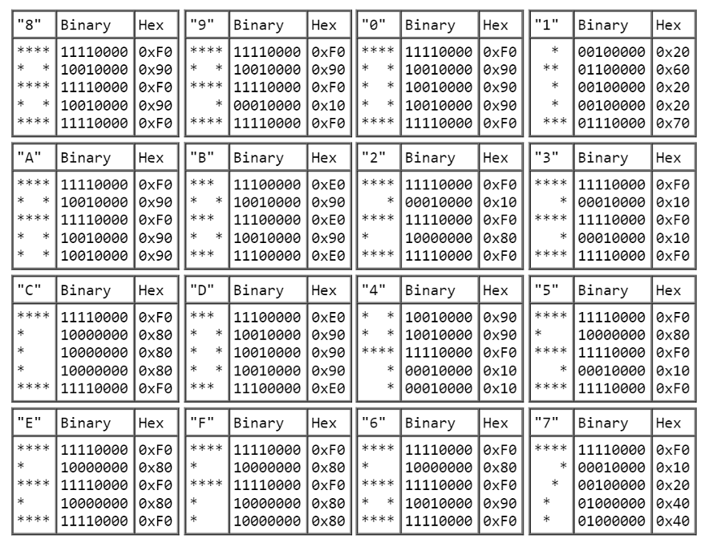

# [2024-12-15-1] Devlog: CHIP-8

# Introduction

In this session, my objectives are:
- Add fonts to the machine.
- Implement the rest of the CHIP-8 instructions.
- Create a ROM loader.

# Fonts In CHIP-8

The CHIP-8 machine stores a default set of sprites for every hexadecimal
character (0 to F). This data is stored somewhere in the first 512 bytes of 
memory.

However, it is common to put the data starting at 0x0050.

The sprite data looks like this:



In memory, the sprite for the character 0 is placed first.

This makes implementing the font data easy in `c8_init()`:

```c
void c8_init(c8_machine_t machine) {
    // ...

    const uint8_t font_data[] = {
        0xF0, 0x90, 0x90, 0x90, 0xF0,  // 0
        0x20, 0x60, 0x20, 0x20, 0x70,  // 1
        0xF0, 0x10, 0xF0, 0x80, 0xF0,  // 2
        0xF0, 0x10, 0xF0, 0x10, 0xF0,  // 3
        0x90, 0x90, 0xF0, 0x10, 0x10,  // 4
        0xF0, 0x80, 0xF0, 0x10, 0xF0,  // 5
        0xF0, 0x80, 0xF0, 0x90, 0xF0,  // 6
        0xF0, 0x10, 0x20, 0x40, 0x40,  // 7
        0xF0, 0x90, 0xF0, 0x90, 0xF0,  // 8
        0xF0, 0x90, 0xF0, 0x10, 0xF0,  // 9
        0xF0, 0x90, 0xF0, 0x90, 0x90,  // A
        0xE0, 0x90, 0xE0, 0x90, 0xE0,  // B
        0xF0, 0x80, 0x80, 0x80, 0xF0,  // C
        0xE0, 0x90, 0x90, 0x90, 0xE0,  // D
        0xF0, 0x80, 0xF0, 0x80, 0xF0,  // E
        0xF0, 0x80, 0xF0, 0x80, 0x80,  // F
    };

    memcpy(&machine->memory[0x0050], font_data, sizeof(font_data));

    // ...
}
```

With this, we can implement the next instruction.

# Instruction: `FX29`

This instruction takes the low nibble of `V[X]`, and points the `I` register
to the sprite data of that nibble.

For example, if `V[X]` is 0xAB, then the `I` register will point to the sprite
that represents the font character "B".

```c
case 0xF:
    // ...

    case 0x29:
        machine->registers.I = 0x0050 + (machine->registers.V[X] & 0xF);

        break;

    // ...
```

# Instruction: `FX33`

This instruction is simpler to explain with an example:

1. Let V[X] = 0x9C.
1. Then V[X] = 0x9C = 156 in decimal.
1. Set the value at `I` to `1`.
1. Set the value at `I + 1` to `5`.
1. Set the value at `I + 2` to `6`.

This instruction extracts the decimal representation of the value of `V[X]`.
Each digit is stored starting from `I`. Since a byte only goes until 255, only
three digits are needed.

```c
case 0xF:
    // ...

    case 0x33:
        machine->memory[machine->registers.I]     = machine->registers.V[X] / 100;
        machine->memory[machine->registers.I + 1] = (machine->registers.V[X] / 10) % 10;
        machine->memory[machine->registers.I + 2] = machine->registers.V[X] % 10;

        break;

    // ...
```

# Instructions: `FX55` and `FX65`

These are the last 2 instructions.

The `FX55` instruction takes the values of `V[0]` to `V[X]` (inclusive), and
stores them starting at `I`.

The final value of `I` is unchanged in modern interpreters. This will be the
behaviour for this emulator as well.

The `FX65` instruction does the opposite, and loads the registers `V[0]` to `V[X]` 
(inclusive) with values from `I` onwards.

```c

case 0xF:
    switch (NN) {
       // ...

        case 0x55:
            for (int i = machine->registers.V[X]; i >= 0; i--) {
                machine->memory[machine->registers.I + i] = machine->registers.V[i];
            }

            break;

        case 0x65:
            for (int i = machine->registers.V[X]; i >= 0; i--) {
                machine->registers.V[i] = machine->memory[machine->registers.I + i];
            }

            break;
    }

```

The implementation uses backwards indexing since the value of `V[X]` might be
modified inside the loop (and thus cannot be used in the condition).


# Loading ROMs

Right now, the IBM Logo ROM is hard-coded during initialization.

A better solution would be to take in a filepath from argv instead:

```c
void c8_init(c8_machine_t machine, const char *path_to_rom) {
    // ...

    FILE *f = fopen(path_to_rom, "rb");

    if (!f) {
        printf("Could not read ROM at %s.\n", path_to_rom);
        return;
    }

    uint8_t rom_buffer[4096];

    size_t rom_size = fread(rom_buffer, sizeof(uint8_t), 4096, f);

    memcpy(&machine->memory[0x0200], rom_buffer, rom_size);
}

int main(int argc, const char *argv[]) {
    if (argc != 2) {
        printf("Usage: CHIP-8 <path_to_rom>");
        return 1;
    }

    printf("\033[=13h");

    c8_machine_t machine = calloc(1, sizeof(struct c8_machine));

    c8_init(machine, argv[1]);

    // ...
}
```

I have taken some ROMs from [this resource](https://github.com/loktar00/chip8/tree/master/roms) and placed them under /assets for testing.

